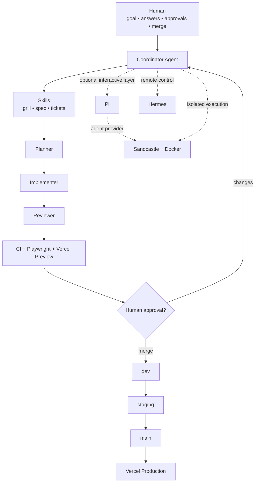
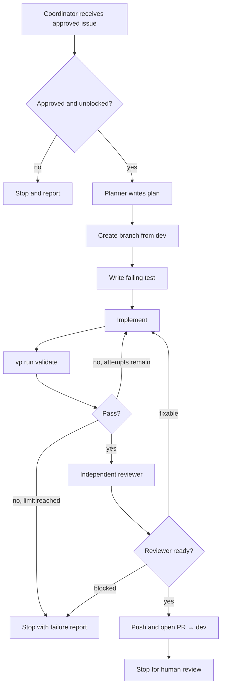
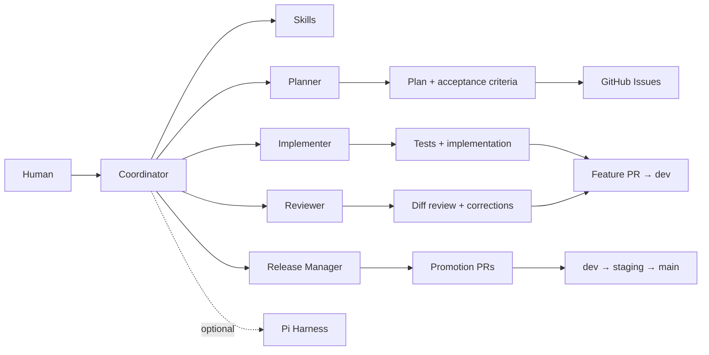
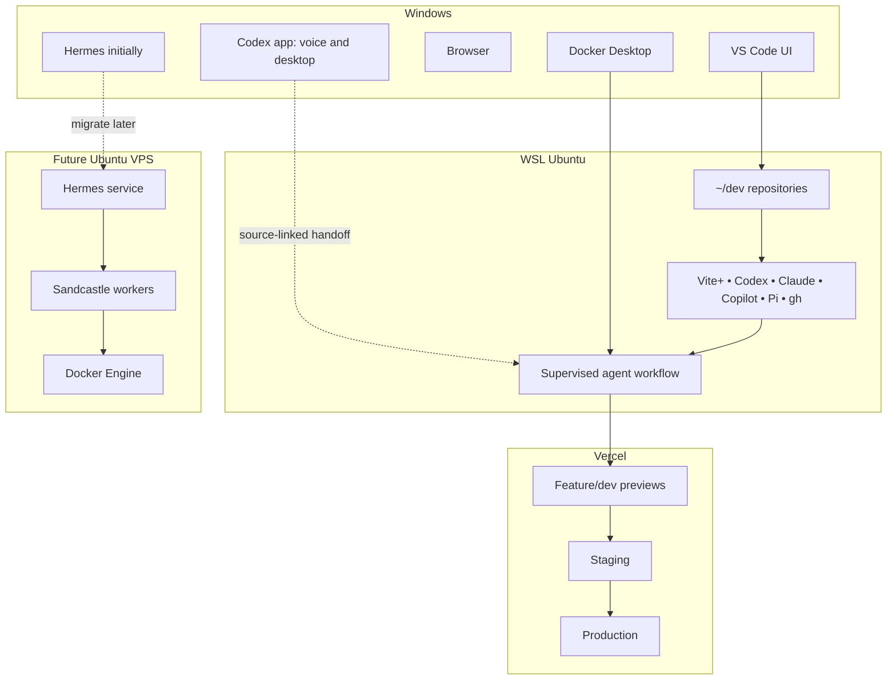
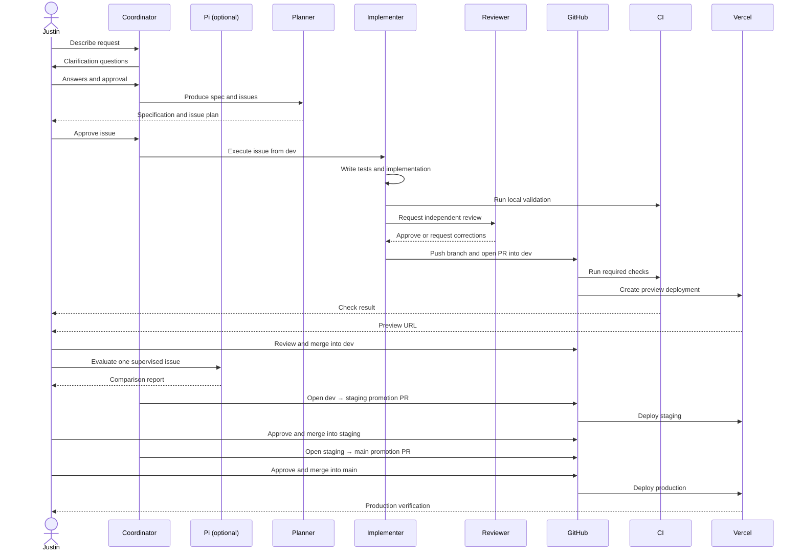

# 🧪 AI Agent Workflow Lab — AI-First Edition

> A checkpoint-based lab for building an AI-driven software workflow where humans provide direction and approval while agents plan, implement, test, review, open pull requests, and prepare deployments.

## Current experiment, September 12, 2026

AI Workflow is Justin's experimentation and testing ground. Workflow, gbrain, personal-memory, and cross-machine topology research belongs in this project. The milestones below remain a staged lab plan; their commands and version snapshots do not establish what is installed today.

Retain the Windows-native Codex app for voice, browser, and native desktop work. Evaluate Ubuntu-native Codex CLI in the existing Linux checkout. Justin chose VS Code connected to Ubuntu WSL as the interface for the next manual experiment; its integrated Ubuntu terminal can run the CLI.

- Read the [architecture and memory baseline](docs/cross-machine-workflow.md) when planning execution boundaries, source ownership, selective retrieval, or a memory pilot. It links the preserved September 12 research and unresolved diagnostic handoff. gbrain is the leading pilot candidate; backend adoption remains open.
- Follow the [manual Matt Pocock skill walkthrough](docs/manual-skill-setup.md) for the next experiment. Justin performs the setup himself after reviewing the proposed changes. The later agent-managed installation prompt is an alternative workflow.
- Use `tools.csv` for catalog changes. [TOOLS.md](TOOLS.md) and [STACK.md](STACK.md) are derived views. Their August entries, including Desktop WSL mode, are historical catalog records and have not been refreshed by this documentation update.

## Target outcome

By the end of this lab, you will have a working pipeline that can:

1. Turn a rough request into a clarified specification and GitHub issues.
2. Assign one approved issue to a planner, implementer, and reviewer.
3. Create an isolated feature branch from `dev`.
4. Write the implementation and tests using TDD.
5. Run Vite+, TypeScript, Vitest, Playwright, and build verification.
6. Open a pull request back into `dev`.
7. Evaluate Pi as an optional interactive orchestration layer.
8. Deploy every branch and pull request to a Vercel preview.
9. Promote approved work from `dev` → `staging` → `main`.
10. Deploy `main` to production through Vercel.
11. Run the same bounded workflow inside Docker and Sandcastle.
12. Start, inspect, or stop approved work remotely through Hermes later.

The lab remains deliberately small and framework-free. It uses plain TypeScript, a tiny browser page, Vite+, Vitest, and Playwright. Do not add Svelte, SvelteKit, React, Tailwind, Storybook, a database, or client code until the workflow itself is proven.

---

# 0. The operating rule

## Human-owned work

You are responsible for:

- Installing and authenticating prerequisite tools.
- Explaining the goal and answering clarification questions.
- Approving specifications and issue breakdowns.
- Approving elevated permissions, secrets, and destructive commands.
- Reviewing pull requests and deployment evidence.
- Merging feature and promotion pull requests.
- Stopping a worker when it exceeds its limits.

## Agent-owned work

The agents are responsible for:

- Creating files, folders, configuration, code, and tests.
- Installing project dependencies.
- Writing `AGENTS.md`, `CONTEXT.md`, specifications, ADRs, and issue templates.
- Creating GitHub issues, labels, branches, commits, and pull requests.
- Running TDD, linting, formatting, type checks, browser tests, and builds.
- Fixing failures within a bounded retry limit.
- Reviewing implementation against the issue and specification.
- Preparing Vercel configuration and verifying preview deployments.
- Preparing release pull requests between long-lived branches.
- Creating Docker, Sandcastle, CI, and VPS bootstrap configuration.

> **Core rule:** The README gives you prompts to hand to agents. It should not ask you to manually type the implementation the agents are supposed to create.

---

# 1. Branch and deployment strategy

AI automation does not make branches obsolete. It makes branch policy easier to enforce.

This lab intentionally uses three long-lived branches because the goal includes learning promotion and deployment boundaries:

| Branch | Purpose | Vercel target |
|---|---|---|
| `dev` | Daily integration branch and default branch | Preview deployment |
| `staging` | Release candidate and final QA | Persistent staging preview or custom environment |
| `main` | Production source of truth | Production deployment |

## Normal work path

```text
GitHub issue
    ↓
feature branch created from dev
    ↓
planner → implementer → reviewer
    ↓
pull request into dev
    ↓
CI + Vercel preview + human review
    ↓
merge into dev
    ↓
promotion pull request: dev → staging
    ↓
staging tests + stable staging URL
    ↓
promotion pull request: staging → main
    ↓
production deployment
```

## Branch rules

- Set `dev` as the repository default branch.
- Create every normal feature branch from the latest `dev`.
- Merge ticket branches only into `dev`.
- Promote `dev` into `staging` through a pull request.
- Promote `staging` into `main` through a pull request.
- Never allow an agent to merge its own pull request.
- Never push directly to `dev`, `staging`, or `main`.
- Require CI before merging.
- Require human approval for `staging` and `main`.
- Keep `main` deployable at all times.

## Hotfix path

A production hotfix may branch from `main`, but after it is merged:

```text
main → staging → dev
```

must be synchronized so the fix is not lost from future work.

## Is this too much for every project?

Possibly. A small solo project may need only feature branches, previews, and `main`. This lab keeps `dev`, `staging`, and `main` so you can deliberately practice:

- AI-created feature branches.
- Integration testing.
- Staging promotion.
- Production promotion.
- Deployment gates.
- Rollback boundaries.

After the lab, you can simplify the branch model without changing the core agent workflow.

---

# 2. Version snapshot

> Package versions were verified **July 29, 2026**. The Ubuntu and global Vite+ baselines were updated **August 5, 2026**. Project runtime and dependency versions remain deliberate; the global `vp` CLI follows the latest published stable release.

| Tool or package | Version policy | Purpose |
|---|---|---|
| Ubuntu | `26.04 LTS` | WSL and future VPS |
| Node.js | `24.18.0` LTS | Runtime managed by Vite+ |
| pnpm | `11.17.0` | Package manager managed by Vite+ |
| `vite-plus` | Latest stable (`0.2.8` verified) | Unified local toolchain |
| TypeScript | `7.0.2` | Language and compiler |
| Vitest | `4.1.10` | Unit and integration tests supplied through Vite+ |
| `@playwright/test` | `1.62.0` | Browser and deployment tests |
| `@playwright/cli` | `0.1.17` | Browser control for coding agents |
| `@openai/codex` | `0.145.0` | WSL CLI execution layer and Sandcastle worker |
| `@anthropic-ai/claude-code` | `2.1.220` | Optional specialist coding agent |
| `@github/copilot` | `1.0.74` | VS Code and terminal agent |
| `@earendil-works/pi-coding-agent` | `0.82.0` | Optional interactive orchestration experiment |
| `skills` | `1.5.20` | Agent Skills installer |
| `vercel` | `58.0.0` | Deployment CLI |
| `@ai-hero/sandcastle` | `0.12.0` | Isolated agent orchestration |
| `tsx` | `4.23.1` | Run Sandcastle TypeScript scripts |

Vite+ and Pi are still pre-1.0. The global Vite+ CLI tracks the latest stable release, with the tested version recorded above. Pi and project-local dependencies change only through a deliberate tooling or dependency update.

## What Vite+ handles

| Vite+ command | Separate tool or direct command you normally use |
|---|---|
| `vp env` | NVM, fnm, or Volta |
| `vp install` | Direct `pnpm install` |
| `vp add` / `vp remove` | Direct `pnpm add` / `pnpm remove` |
| `vp dev` | Vite development server |
| `vp check` | Formatting, linting, and TypeScript checking |
| `vp test` | Vitest |
| `vp build` | Vite/Rolldown production build |
| `vp run` | Package scripts and task execution |
| `vp install -g` | Global Node packages managed across Node versions |

Vite+ detects and downloads the workspace package manager automatically. When a project declares none, Vite+ falls back to pnpm. Use the normalized `vp` commands instead of requiring a separately installed global `pnpm` binary.

Inside WSL, Vite+ is the only Node.js and package-manager authority for this lab. Do not install NVM, fnm, Volta, a standalone Node.js runtime, or a separately managed pnpm installation in Ubuntu. The Windows host may retain its own Node.js tools for unrelated Windows-native work, but they are not prerequisites for this workflow.

## Tool choice — JavaScript and TypeScript toolchain

Node with Vite+ is selected because it keeps broad Node ecosystem compatibility while giving humans and agents one consistent command surface for environment management, installation, checking, testing, building, and task execution.

1. **Node.js + Vite+ — selected for this lab**
2. Deno — integrated runtime and tooling, but changes the runtime and ecosystem assumptions
3. Bun — fast runtime and package manager, but not the compatibility baseline for this workflow

## Tool choice — browser testing

Playwright is selected because it supports Chromium, Firefox, WebKit, traces, screenshots, videos, headless VPS execution, and deployment smoke testing from one system.

1. **Playwright — selected for this lab**
2. Cypress — mature browser testing with a strong interactive runner
3. WebdriverIO — flexible WebDriver-based automation for broader browser and device setups

---

# Milestone 1 — Install and authenticate prerequisites

## Goal

Reach the point where a coordinator agent can work inside a WSL repository and use GitHub.

This is the only intentionally manual milestone.

## Tool choice — code editor

VS Code is selected because it already matches the current workflow, has first-class WSL support, supports GitHub Copilot custom agents and instructions, and can run every CLI in the integrated WSL terminal. The repository remains editor-independent through `AGENTS.md`, Git, scripts, and standard configuration.

1. **VS Code — selected for this lab**
2. Zed — compelling for ACP agents, Pi integration, terminal threads, and parallel agent sessions
3. Cursor — AI-first VS Code derivative with built-in agent workflows
4. Windsurf — AI-first editor with integrated coding-agent features

Do not switch editors during the initial lab. Re-evaluate Zed after the workflow works reliably in VS Code.

## Windows-side prerequisites

Keep these on Windows:

- VS Code.
- The WSL extension for VS Code.
- The ChatGPT/Codex desktop app.
- Docker Desktop.
- Your browser.
- Photoshop and design-source files.
- Hermes temporarily.

The current experiment keeps the Codex desktop agent Windows-native and evaluates a separate Ubuntu CLI through VS Code. No desktop settings change is required by this plan. The earlier lab proposed the following Desktop-in-WSL arrangement, retained here as a future alternative requiring its own capability check:

```text
Agent environment      → Windows Subsystem for Linux
Integrated terminal    → WSL
WSL default distro     → Ubuntu-26.04
Repository location    → ~/dev/agent-workflow
```

The agent-environment setting and terminal-shell setting control separate execution contexts. Selecting a WSL terminal alone does not relocate the desktop agent. The historical `~/dev/agent-workflow` example is not this checkout; use the existing `/home/justin/dev/ai-workflow` folder. Follow the [dated topology evidence and limits](docs/cross-machine-workflow.md#evidence-and-ownership) before choosing another arrangement.

Enable Docker Desktop integration for Ubuntu 26.04:

```text
Docker Desktop
→ Settings
→ Resources
→ WSL Integration
→ Enable Ubuntu-26.04
```

Do not install a second Docker Engine inside WSL.

## WSL-side prerequisites

Inside Ubuntu 26.04:

```bash
sudo apt update

sudo apt install --yes \
  build-essential \
  ca-certificates \
  curl \
  git \
  jq \
  unzip \
  gh
```

Create one code location:

```bash
mkdir --parents ~/dev
cd ~/dev
```

Install the latest stable Vite+ CLI. Vite+ manages Node.js and the project package manager, so do not install NVM or a separate Node.js runtime inside WSL:

```bash
curl -fsSL https://vite.plus | bash
```

Close and reopen the WSL shell, then configure and verify Vite+:

```bash
vp --version
vp env setup
vp env on
vp env install 24.18.0
vp env default 24.18.0
vp env doctor
```

Install the Linux agent CLIs:

```bash
vp install -g @openai/codex@0.145.0
vp install -g @anthropic-ai/claude-code@2.1.220
vp install -g @github/copilot@1.0.74
vp install -g @playwright/cli@0.1.17
vp install -g vercel@58.0.0
```

Authenticate:

```bash
gh auth login
codex
claude
copilot
vercel login
```

Install Playwright CLI skills for coding agents:

```bash
playwright-cli install --skills
```

Verify Linux paths:

```bash
command -v git
command -v gh
command -v vp
command -v node
command -v npm
command -v corepack
vp pm --version
command -v codex
command -v claude
command -v copilot
command -v playwright-cli
command -v vercel
```

The Linux development commands above must not resolve under `/mnt/c`, `/mnt/d`, or `/mnt/v`. The Windows `code` launcher is the intentional exception: running `code .` from WSL should open Windows VS Code connected to the Linux repository through the VS Code Server.

## Create the repository workspace

Clone this repository into WSL:

```bash
cd ~/dev
git clone https://github.com/oneezy/agent-workflow.git
cd agent-workflow
code .
```

## Completion gate

Proceed only when:

- VS Code says it is connected to WSL.
- `gh auth status` succeeds.
- At least one coding agent is authenticated.
- `vp env doctor` succeeds.
- Docker works inside WSL with `docker version`.
- The repository is located under `~/dev`.

---

# Milestone 2 — Launch the bootstrap coordinator

## Goal

Use one agent prompt to create the complete framework-free project instead of building it manually.

## Tool choice — supervised coordinator and portable execution layer

Codex Desktop remains the Windows-native voice and desktop coordinator. The next experiment evaluates Ubuntu Codex CLI through VS Code connected to WSL for coding in existing Linux repositories. CLI installation, effective configuration, and successful task execution are separate acceptance checks; this plan does not claim they have passed. Docker, Sandcastle, and VPS execution remain later lab stages.

1. **Windows-native Codex Desktop — retained for voice, browser, and desktop work**
2. **Codex CLI inside WSL — next coding experiment through VS Code's Ubuntu terminal**
3. Claude Code — optional specialist for planning, architecture, implementation, and review
4. GitHub Copilot CLI — optional GitHub-native and VS Code-adjacent worker
5. Pi — optional competing interactive harness evaluated after the first clean Codex PR
6. OpenCode — provider-flexible terminal agent and another Sandcastle-supported option

Codex Desktop, Codex CLI, Pi, and Sandcastle are not interchangeable. Desktop provides the human-facing control surface; the CLI provides portable execution; Pi is an optional alternate harness; Sandcastle adds bounded branch, worktree, sandbox, retry, and cleanup orchestration. Shared behavior belongs in `AGENTS.md`, skills, tests, scripts, and repository policy so the worker can change later.

For the current manual experiment, use the [skill walkthrough](docs/manual-skill-setup.md). The bootstrap prompt below belongs to a later implementation milestone after its scope is approved. It is not a prerequisite for using this existing project:

```text
You are the bootstrap coordinator for this AI workflow lab.

Do not ask me to create project files, configuration, source code, tests, branches,
issues, or pull requests manually. You own those tasks.

First inspect the repository, environment, installed tools, Git state, and GitHub
remote. Read README.md before making changes.

Build a framework-free TypeScript lab using these exact versions:

- Node.js 24.18.0 managed by Vite+
- pnpm 11.17.0 managed by Vite+
- vite-plus 0.2.6
- typescript 7.0.2
- Vitest 4.1.10 supplied through Vite+
- @playwright/test 1.62.0

The application should be deliberately tiny: a browser page with one small,
testable TypeScript behavior. Do not add a framework, CSS framework, database,
Storybook, or unnecessary packages.

Repository workflow:

1. Ensure the long-lived branches dev, staging, and main exist.
2. Set dev as the default development branch when GitHub permissions allow it.
3. Never commit the bootstrap implementation directly to a long-lived branch.
4. Create a branch named setup/bootstrap-lab from dev.
5. Create and configure the project.
6. Create unit tests and Playwright tests before or alongside implementation.
7. Add one canonical validation command: vp run validate.
8. Add AGENTS.md, CONTEXT.md, docs/specs, docs/adr, and GitHub templates.
9. Add .gitignore, .gitattributes, .env.example, and repository hygiene.
10. Run installation, validation, tests, browser tests, and the production build.
11. Fix failures, but stop after three failed correction attempts.
12. Commit the work, push the branch, and open a pull request into dev.
13. Do not merge the pull request.
14. Return a concise report containing:
    - files created
    - commands run
    - test results
    - risks or assumptions
    - pull request URL
    - exact items I should review

Ask only for information or approval that you truly cannot obtain yourself.
Stop before any destructive operation or merge.
```

## Expected agent output

The bootstrap agent should create something close to:

```text
agent-workflow/
├── .github/
│   ├── agents/
│   ├── ISSUE_TEMPLATE/
│   ├── workflows/
│   └── pull_request_template.md
├── docs/
│   ├── adr/
│   └── specs/
├── e2e/
├── src/
├── AGENTS.md
├── CONTEXT.md
├── index.html
├── package.json
├── playwright.config.ts
├── tsconfig.json
├── vite.config.ts
└── pnpm-lock.yaml
```

The exact structure may differ if the agent explains why.

## Human checkpoint

Review only:

- The pull request summary.
- The package versions.
- The `validate` command.
- The branch target (`dev`).
- Test evidence.
- Whether the project stayed framework-free.

Merge the bootstrap PR into `dev` only after it passes.

---

# Milestone 3 — Have the agent create the project brain and team

## Goal

Create reusable instructions and specialized roles without manually writing agent files.

Give the coordinator this prompt after the bootstrap PR is merged:

```text
Create the project brain and agent team for this repository.

Work from the latest dev branch on a new branch named setup/agent-team.
Do not modify main or staging directly.

Create or improve:

- AGENTS.md as the canonical shared instruction file
- CONTEXT.md for project purpose and vocabulary
- docs/specs for approved behavior
- docs/adr for architectural decisions
- a coordinator role
- a planner role
- an implementer role
- a reviewer role
- a release-manager role

The coordinator must delegate instead of implementing everything itself.

The planner may research and write a plan but may not edit implementation files.
The implementer must use TDD and may edit only the approved issue scope.
The reviewer must compare the diff against the issue, specification, tests, and
AGENTS.md. It should fix only small clear defects; otherwise it should request
changes.
The release manager may open promotion pull requests but may never merge them.

All roles must:

- use vp run validate as the objective completion gate
- stop after three failed correction attempts
- avoid secrets and destructive commands
- create one branch per issue from dev
- open pull requests into dev
- never merge their own work

Commit, push, and open a pull request into dev. Do not merge it.
```

## Agent team contract

```text
Coordinator
├── clarifies the request
├── chooses or invokes skills
├── delegates planning
├── delegates implementation
├── delegates review
└── reports status

Planner
├── reads context
├── identifies risks
├── writes the implementation plan
└── defines acceptance criteria

Implementer
├── creates the issue branch from dev
├── writes or updates tests
├── implements the change
├── runs validation
└── commits and pushes

Reviewer
├── reviews the diff
├── checks acceptance criteria
├── checks tests and scope
├── requests corrections
└── approves readiness for human review

Release manager
├── opens dev → staging PRs
├── gathers staging evidence
├── opens staging → main PRs
└── never merges
```

## Human checkpoint

Verify that the roles have clear permissions and stop conditions. Merge the PR into `dev`.

> 📺 **Video walkthrough:** [Mastering AI With VS Code’s Agent Customizations](https://www.youtube.com/watch?v=os2eqa69gko)

---

# Milestone 4 — Install Agent Skills and generate the first work package

## Goal

Turn a rough idea into a specification, small issues, and an approved execution plan.

For the current experiment, Justin will perform Matt's documented setup manually using the [verified walkthrough](docs/manual-skill-setup.md). It distinguishes the publisher's commands from this lab's Vite+ adaptation, checks existing skill-name collisions, and stops for review before setup writes project instructions. The July/August package pins below belong to the older lab recipe.

For a later agent-managed installation, the original coordinator prompt is:

```text
Install the current project-scoped Agent Skills from mattpocock/skills using
skills 1.5.20. Target Codex, Claude Code, GitHub Copilot, and Pi when supported.

Inspect every installed skill before using it. Commit the skill files or links
only if they are portable and appropriate for this repository.

Use the relevant grilling, specification, ticket-writing, TDD, implementation,
and review skills to turn my next request into:

1. clarification questions
2. an approved specification
3. vertical GitHub issues
4. dependencies and blockers
5. acceptance criteria
6. test expectations
7. an execution order

Do not begin implementation until I approve the specification and issues.
Open a setup pull request into dev for any skill installation changes.
```

The coordinator may use:

```bash
vp dlx skills@1.5.20 add mattpocock/skills
```

but you should not need to type it yourself; the agent should run it.

## First lab request

Give the coordinator a deliberately small request, such as:

```text
Add a small, visible history panel that records the last five calculations.
Users can clear the history. Persist nothing between page reloads.
```

The agent should grill the request, write the specification, and create small GitHub issues.

## Human checkpoint

Approve:

- The behavior.
- The issue boundaries.
- The acceptance criteria.
- Which issue runs first.

> 📺 **Video walkthrough:** [mattpocock/skills: A Complete AI Coding Workflow](https://www.youtube.com/watch?v=M6mYodf0dJM)

> 📺 **Video walkthrough:** [Full Walkthrough: Workflow for AI Coding](https://www.youtube.com/watch?v=-QFHIoCo-Ko)

> 📺 **Video walkthrough:** [Building a Real Feature With Claude Code](https://www.youtube.com/watch?v=hX7yG1KVYhI)

---

# Milestone 5 — Run the first complete agent-created pull request

## Goal

Complete one approved issue without manually creating code, tests, branches, or the PR.

Give the coordinator:

```text
Execute approved GitHub issue #<NUMBER> through the full supervised workflow.

Requirements:

1. Confirm the issue is approved, unblocked, and based on the latest dev.
2. Delegate a plan to the planner.
3. Create a feature branch from dev using issue/<number>-<slug>.
4. Delegate implementation to the implementer.
5. Require test-first or test-alongside development.
6. Run vp run validate.
7. Delegate independent review to the reviewer.
8. Permit at most three correction cycles.
9. Commit and push the final branch.
10. Open a pull request into dev.
11. Link the issue and include:
    - summary
    - acceptance-criteria checklist
    - tests run
    - screenshots or Playwright artifacts when relevant
    - known risks
    - rollback notes
12. Do not merge.
13. Stop and give me the PR URL and a concise review checklist.
```

## Required validation gate

The agent must create and use one command:

```bash
vp run validate
```

It should cover:

```text
format/lint/typecheck
→ unit tests
→ Playwright tests
→ production build
```

## Human checkpoint

Inspect:

- The PR target is `dev`.
- The diff matches the issue.
- CI is green.
- The preview deployment works.
- The reviewer found no unresolved defects.

Then merge into `dev`.

> 📺 **Video walkthrough:** [I’m Using `claude --worktree` for Everything Now](https://www.youtube.com/watch?v=yv8VZpov8bk)

---

# Milestone 6 — Evaluate Pi as the interactive orchestration layer

## Goal

Test Pi after the basic coordinator → planner → implementer → reviewer workflow has produced one clean pull request. Pi is an optional interactive control plane; it does not replace GitHub, CI, Docker, or Sandcastle.

## Tool choice — interactive agent harness

Pi is selected for a bounded evaluation because its minimal core can switch models and gain custom tools, extensions, skills, prompt templates, and subagents without forcing the whole workflow into one vendor-specific product.

1. **Pi — selected for evaluation as the interactive orchestrator**
2. Codex Desktop and Codex CLI — remain the supervised control surface and portable primary worker
3. Claude Code — remains an optional planning, architecture, implementation, and review worker
4. GitHub Copilot CLI — remains useful for GitHub-native and VS Code-adjacent work

Install the pinned Pi version only for this experiment:

```bash
npm install --global --ignore-scripts @earendil-works/pi-coding-agent@0.82.0
pi
```

Use `/login` inside Pi for supported subscription providers.

> **Security:** Pi extensions and packages execute with the user's system permissions. Review source code before installing third-party packages. Start with stock Pi and add extensions one at a time.

## Evaluation prompt

Give Pi this task from the repository root:

```text
Act as the interactive coordinator for one small approved GitHub issue.

Read AGENTS.md, CONTEXT.md, the approved specification, and the issue before acting.
Use the existing branch policy and validation command.

Delegate or route work by role when useful:
- planning and architecture
- implementation
- testing
- independent review

Create one feature branch from dev, complete the issue, run vp run validate,
commit, push, and open a pull request into dev. Do not merge.

Use no more than three correction cycles. Stop for secrets, destructive actions,
permission expansion, unresolved architectural decisions, or repeated failures.
Return the PR URL, models or workers used, tests run, time taken, and remaining risks.
```

## Pi versus Sandcastle

```text
Pi
→ interactive conversation, model routing, tools, extensions, and subagents

Sandcastle
→ branch/worktree lifecycle, isolated sandbox, bounded iterations, commits, and PR workflow

Combined
→ Pi can be the agent provider running inside a Sandcastle sandbox
```

After Pi completes one supervised issue, ask Sandcastle to run one documentation-only issue using Pi as the agent provider. Compare Pi with the original Codex Desktop and CLI run on:

- Result quality.
- Time.
- Cost or subscription usage.
- Ease of steering.
- Logs and observability.
- Isolation and cleanup.

## Decision gate

Keep Pi only when it provides a clear improvement. The acceptable outcomes are:

- Promote Pi to the preferred interactive coordinator.
- Keep Pi as an optional specialist harness.
- Remove Pi and continue with Codex, Claude Code, and Copilot.

Do not copy another developer's entire Pi configuration into this repository. Add extensions one at a time and review every source.

> 📺 **Video walkthrough:** [Using Pi to Orchestrate Coding Agents](https://www.youtube.com/watch?v=5Qu2SkSQeBU)

---

# Milestone 7 — Let the agent configure CI and branch policy

## Goal

Turn the workflow rules into objective GitHub enforcement.

Give the coordinator:

```text
Configure GitHub CI and branch policy for this repository.

Work on a setup branch from dev and open a PR into dev.

Create CI that installs the pinned Vite+ toolchain and runs vp run validate for
pull requests targeting dev, staging, or main.

Create or propose GitHub rulesets for dev, staging, and main:

- require pull requests
- require the validation workflow
- block force pushes
- block branch deletion
- require human approval for staging and main
- prevent agents from bypassing checks

Add a workflow or policy check that enforces:

- normal feature PRs target dev
- staging promotion PRs come from dev
- production promotion PRs come from staging
- a documented hotfix path may branch from main

Use gh or the GitHub API when permissions allow. Before applying repository
rules or settings, show me the exact proposed changes and ask for approval.

Do not merge the setup PR.
```

## Why CI matters

An agent saying “tests pass” is not evidence. GitHub CI is the shared source of truth for:

- Human work.
- Codex work.
- Claude Code work.
- Copilot work.
- Pi work.
- Sandcastle work.
- Promotion pull requests.

## Human checkpoint

Approve the rules, merge the setup PR into `dev`, and apply the GitHub rulesets.

---

# Milestone 8 — Connect Vercel and deploy through branches

## Goal

Deploy previews, staging, and production without giving an agent permission to publish arbitrary code directly.

## Tool choice — deployment platform

Vercel is selected because Git integration, pull-request previews, branch deployments, and production promotion require the least infrastructure work. This lets the lab test deployment gates before taking on VPS administration.

1. **Vercel — selected for previews, staging, and production in this lab**
2. Coolify on a VPS — strong later option for self-hosting applications, databases, and supporting services
3. Cloudflare Pages and Workers — strong option for edge-first applications and Cloudflare-native services
4. Netlify — established Git-based preview and deployment platform

The repository must not depend permanently on Vercel-specific behavior. Keep builds, tests, environment contracts, and Docker support portable so Coolify or another host can replace Vercel later.

Vercel automatically creates preview deployments for non-production branches and production deployments from the configured production branch.

## Environment mapping

| Git branch | Vercel behavior |
|---|---|
| Feature branches | Unique preview deployment per push or PR |
| `dev` | Branch preview used for integrated development testing |
| `staging` | Persistent staging preview or custom staging environment |
| `main` | Production deployment |

## Human-only setup

You must complete browser authentication and secret entry:

1. Connect the GitHub repository to Vercel.
2. Configure `main` as the Production Branch.
3. Add required environment variables without exposing them to agents.
4. Decide how staging receives a stable URL:
   - **Free plan:** assign a domain or branch URL to the `staging` preview branch.
   - **Pro or Enterprise:** create a custom `staging` environment with branch tracking.
5. Keep automatic production deployment tied to merges into `main`.

Official references:

- [Deploying Git repositories with Vercel](https://vercel.com/docs/git)
- [Vercel environments](https://vercel.com/docs/deployments/environments)
- [Assigning a domain to a Git branch](https://vercel.com/docs/domains/working-with-domains/assign-domain-to-a-git-branch)
- [Promoting preview deployments](https://vercel.com/docs/deployments/promote-preview-to-production)

## Agent setup prompt

```text
Prepare this framework-free Vite+ project for Vercel.

Work on a setup branch from dev.

Inspect the current build output and create only the configuration needed for:

- install command: vp install
- build command: vp build
- output directory: dist
- feature and dev preview deployments
- staging branch deployment
- main production deployment

Add deployment smoke tests that can run against a supplied URL using Playwright.
Do not add secrets. Use .env.example for names only.

Use the Vercel CLI only after I complete authentication. Link and inspect the
project when authorized, but do not deploy to production manually.

Commit, push, and open a pull request into dev. Do not merge.
```

## Promotion prompt: `dev` → `staging`

```text
Act as release manager.

Prepare a promotion pull request from dev into staging.

Before opening it:

- confirm dev CI is green
- summarize included issues and PRs
- identify migrations, environment changes, and risks
- run the complete validation gate
- verify the current dev preview with Playwright
- create a release checklist

Open the PR. Do not merge it.
After the staging deployment is ready, run smoke tests against its URL and add
the evidence to the PR.
```

## Promotion prompt: `staging` → `main`

```text
Act as release manager.

Prepare a production promotion pull request from staging into main.

Require:

- green staging CI
- successful staging deployment
- passing Playwright smoke tests against staging
- no unresolved release blockers
- rollback notes
- a concise production verification plan

Open the PR. Do not merge and do not run vercel --prod.
The production deployment must be triggered by my human-approved merge into main.
```

## Human checkpoint

For staging:

- Review the release scope.
- Review staging deployment evidence.
- Merge `dev` → `staging`.

For production:

- Review the staging evidence and rollback plan.
- Merge `staging` → `main`.
- Verify the resulting production deployment.

---

# Milestone 9 — Add Docker and Sandcastle through an agent

## Goal

Move the proven local workflow into an isolated execution environment.

Do not add Sandcastle before the supervised issue-to-PR loop and CI are working.

## Tool choice — sandbox and orchestration

Docker Desktop and Sandcastle are selected together because they solve different parts of the problem: Docker supplies the local Linux sandbox, while Sandcastle manages agents, branches or worktrees, bounded iterations, prompts, commits, and results.

1. **Docker Desktop + Sandcastle — selected for the first isolated workflow**
2. Podman + Sandcastle — rootless local-container alternative
3. Vercel Sandbox + Sandcastle — cloud Firecracker microVM option for disposable remote workers
4. A custom Sandcastle sandbox provider — later option for another cloud or internal platform

Pi, Codex, Claude Code, Copilot, Cursor, and OpenCode are agent-provider choices inside Sandcastle. Docker, Podman, and Vercel are sandbox-provider choices. Do not treat those two categories as interchangeable.

Give the coordinator:

```text
Add an isolated Sandcastle worker to this repository.

Use these exact packages:

- @ai-hero/sandcastle 0.12.0
- tsx 4.23.1

Use Docker Desktop through WSL for the local sandbox.

Work on a setup branch from dev. Use the Sandcastle initializer and inspect the
generated files. Configure the safest small workflow:

- select one approved GitHub issue
- create an explicit feature branch from dev
- run inside Docker
- use a planner, implementer, and reviewer sequence
- run vp run validate
- allow at most three iterations
- require an explicit completion signal
- stop on repeated failures
- never merge
- open or prepare a PR into dev

Do not expose host secrets to the container. Use the narrowest required token
and environment access. Ask me before adding any credential.

Commit, push, and open a setup pull request into dev. Do not merge.
```

## First isolated test

After the setup PR is merged, give the coordinator:

```text
Run one documentation-only issue through Sandcastle.

Use one issue, one branch, one container, a maximum of two correction cycles,
and no merge permission. Return the branch, commits, validation results,
container cleanup status, and PR URL.
```

## Second isolated test — Pi inside Sandcastle

```text
Run one documentation-only issue through Sandcastle using Pi as the agent provider.

Use the same branch policy, validation gate, runtime limit, correction limit,
credential restrictions, and no-merge rule as the original Sandcastle test.
Return a comparison against the Codex-backed Sandcastle run.
```

> 📺 **Video walkthrough:** [I Open-Sourced My Own AFK Software Factory](https://www.youtube.com/watch?v=E5-QK3CDVQM)

---

# Milestone 10 — Add bounded autonomous execution

## Goal

Allow an agent to work without constant supervision while preserving clear limits.

Every autonomous run must have:

| Limit | Initial value |
|---|---:|
| Issues per run | `1` |
| Parallel workers | `1` |
| Correction cycles | `3` |
| Runtime | `30 minutes` |
| Branch target | `dev` |
| Merge permission | `none` |
| Production permission | `none` |
| Destructive commands | `blocked` |

## Required state machine

```text
validate issue
→ plan
→ create branch from dev
→ write failing test
→ implement
→ run validation
→ review
→ correct within limit
→ push
→ open PR into dev
→ stop
```

## Completion contract

A successful run must return:

- Issue number.
- Branch name.
- Commit SHAs.
- Validation command and result.
- Reviewer result.
- PR URL.
- Remaining risks.
- Sandbox cleanup status.

A failed run must return:

- The failed step.
- Attempts used.
- Relevant logs.
- Current branch or worktree location.
- Whether uncommitted changes remain.
- Recommended human action.

> 📺 **Video walkthrough:** [How to Write AI Agent Loops in Claude Code and Codex](https://www.youtube.com/watch?v=JoXbk2fm7jM)

---

# Milestone 11 — Add Hermes as a remote control plane

## Goal

Use Hermes to start and supervise bounded jobs, not as an unrestricted replacement for the coding worker.

Keep Hermes on Windows during the local lab. It may call WSL through `wsl.exe`.

## Tool choice — remote control

Hermes with Discord is selected for the remote-control experiment because it can provide a phone-accessible command surface while the actual coding work remains inside the bounded WSL or VPS worker.

1. **Hermes + Discord — selected for the later remote-control milestone**
2. Codex mobile — useful for directly steering Codex sessions without building a separate command layer
3. SSH through Tailscale — simple private administrative access without an AI control plane
4. Zed or another ACP client — useful for organizing agent sessions, but not a replacement for a continuously running worker

Allow only commands such as:

```text
start issue <number>
status issue <number>
stop issue <number>
show PR <number>
prepare staging release
```

Hermes must not:

- Merge pull requests.
- Push directly to long-lived branches.
- Deploy production.
- Read arbitrary secrets.
- Execute arbitrary Discord-provided shell commands.
- Change GitHub or Vercel security settings.

The Windows Hermes process can invoke WSL:

```powershell
wsl.exe -d Ubuntu-26.04 -- bash -lc "cd ~/dev/agent-workflow && <bounded-command>"
```

Later, move Hermes and the autonomous worker to a Linux VPS so they can run continuously.

> 📺 **Video walkthrough:** [Hermes Agent Setup With Discord — Complete Guide](https://www.youtube.com/watch?v=mVHXwlSMQlQ)

---

# Milestone 12 — Prepare the future VPS

## Goal

Make the future move reproducible rather than copying the WSL machine manually.

Ask the coordinator to create:

```text
scripts/bootstrap-ubuntu.sh
```

The script should be idempotent and support:

```bash
./scripts/bootstrap-ubuntu.sh --wsl
./scripts/bootstrap-ubuntu.sh --vps
```

## WSL mode

The script should verify or install:

- Ubuntu prerequisites.
- Git and GitHub CLI.
- Vite+.
- Managed Node and pnpm.
- Coding-agent CLIs.
- Playwright browsers.
- `~/dev`.
- Git settings.
- Docker Desktop integration without installing Docker Engine.

## VPS mode

It should add:

- Native Docker Engine and Compose.
- A non-root deployment user.
- SSH and firewall basics.
- Playwright Linux dependencies.
- Hermes service prerequisites.
- Sandcastle worker prerequisites.
- Optional Tailscale.

Do not include Coolify in the first VPS bootstrap. Treat it as a later, separate infrastructure decision after the agent worker is stable.

A VPS migration should consist of:

```text
bootstrap script
+ cloned repositories
+ securely restored secrets
+ service configuration
```

—not a copy of the entire WSL filesystem.

---

# Milestone 13 — Prove and graduate the workflow

## Required scorecard

Complete at least:

- 3 documentation or configuration issues.
- 3 small TypeScript feature issues.
- 2 bug-fix issues.
- 2 Playwright or browser issues.
- 1 supervised Pi issue.
- 2 `dev` → `staging` promotions.
- 1 `staging` → `main` production promotion.
- 3 Sandcastle runs, including one Pi-backed run.
- 1 intentionally failed bounded run with a useful failure report.

## Graduation criteria

The lab is ready for a larger project only when:

- Agents consistently use the repository instructions.
- Every issue starts from `dev`.
- Feature PRs reliably target `dev`.
- CI and preview deployment evidence appear automatically.
- Release PRs follow `dev` → `staging` → `main`.
- Production deploys only after a human merge into `main`.
- Agents stop when limits are exceeded.
- No secrets appear in commits, logs, PRs, or screenshots.
- Human review remains the final merge boundary.
- The same flow works locally and inside Sandcastle.
- Pi has been deliberately accepted, limited, or rejected based on evidence.

## Adapting to a real project

When applying this workflow to a SvelteKit or other framework project:

1. Keep the branch, issue, agent, CI, review, and deployment model.
2. Replace only the project-specific setup and validation commands.
3. Verify framework support for the chosen TypeScript compiler.
4. Add framework-specific skills and context.
5. Add database migration and rollback gates before production.
6. Add environment-specific storage and database resources.
7. Re-evaluate whether all three long-lived branches are still worth the ceremony.
8. Re-evaluate the editor, agent harness, sandbox, deployment platform, and remote-control choices without changing the portable repository contract.

---

# Security checklist

- [ ] Agents cannot merge their own pull requests.
- [ ] Agents cannot push directly to `dev`, `staging`, or `main`.
- [ ] Production deploys only from `main`.
- [ ] `main` receives changes only from reviewed promotion or hotfix PRs.
- [ ] CI is required on all long-lived branches.
- [ ] Secrets are stored outside Git.
- [ ] Preview secrets are separated from production secrets.
- [ ] Sandboxes receive only required credentials.
- [ ] Logs and screenshots are checked for secrets.
- [ ] Autonomous workers have runtime and retry limits.
- [ ] Pi packages and extensions are source-reviewed before installation.
- [ ] Hermes accepts validated commands rather than arbitrary shell text.
- [ ] Destructive actions require human approval.
- [ ] Rollback steps are included in production release PRs.

---

# Definition of complete

The lab is complete when this flow works without you manually writing project code:

```text
You provide a request
→ coordinator clarifies
→ skill creates specification
→ planner creates vertical issues
→ you approve
→ implementer creates branch from dev
→ implementer writes tests and code
→ reviewer checks and corrects
→ CI and Vercel preview verify
→ agent opens PR into dev
→ you review and merge
→ Pi is evaluated as an optional interactive coordinator
→ release manager opens dev → staging PR
→ staging deploys and passes smoke tests
→ you merge
→ release manager opens staging → main PR
→ you approve and merge
→ Vercel deploys production
→ production smoke tests pass
→ Sandcastle proves the same loop in isolation
→ Hermes later provides bounded remote control
```

---

# 📺 Video walkthrough index

| Topic | Video |
|---|---|
| Complete skills workflow | 📺 [mattpocock/skills: A Complete AI Coding Workflow](https://www.youtube.com/watch?v=M6mYodf0dJM) |
| Full workflow workshop | 📺 [Full Walkthrough: Workflow for AI Coding](https://www.youtube.com/watch?v=-QFHIoCo-Ko) |
| Real feature session | 📺 [Building a Real Feature With Claude Code](https://www.youtube.com/watch?v=hX7yG1KVYhI) |
| Third-party workflow reproduction | 📺 [From Idea to Production Code in Minutes](https://www.youtube.com/watch?v=YIfluAXBr2M) |
| Git worktrees | 📺 [I’m Using `claude --worktree` for Everything Now](https://www.youtube.com/watch?v=yv8VZpov8bk) |
| VS Code agents | 📺 [Mastering AI With VS Code’s Agent Customizations](https://www.youtube.com/watch?v=os2eqa69gko) |
| Pi orchestration | 📺 [Using Pi to Orchestrate Coding Agents](https://www.youtube.com/watch?v=5Qu2SkSQeBU) |
| Sandcastle | 📺 [I Open-Sourced My Own AFK Software Factory](https://www.youtube.com/watch?v=E5-QK3CDVQM) |
| Bounded loops | 📺 [How to Write AI Agent Loops in Claude Code and Codex](https://www.youtube.com/watch?v=JoXbk2fm7jM) |
| Hermes and Discord | 📺 [Hermes Agent Setup With Discord — Complete Guide](https://www.youtube.com/watch?v=mVHXwlSMQlQ) |
| Broader ecosystem | 📺 [AI-Assisted Coding Full Course](https://www.youtube.com/watch?v=wlpBCazAY9Q) |

---

# 🗺️ Architecture diagrams

## 1. AI-first world map



## 2. Branch and deployment pipeline

```mermaid
flowchart LR
  ISSUE["Approved issue"] --> FEATURE["issue/123-feature<br/>from dev"]
  FEATURE --> PRDEV["PR → dev"]
  PRDEV --> CI1["CI + preview"]
  CI1 --> DEV["dev<br/>integration preview"]
  DEV --> PRST["Promotion PR<br/>dev → staging"]
  PRST --> CI2["CI + staging smoke tests"]
  CI2 --> STAGING["staging<br/>stable staging URL"]
  STAGING --> PRMAIN["Promotion PR<br/>staging → main"]
  PRMAIN --> CI3["CI + release gate"]
  CI3 --> MAIN["main"]
  MAIN --> PROD["Production deployment"]
```



## 3. One issue runtime loop



## 4. Agent responsibilities



## 5. Local-to-VPS architecture



## 6. End-to-end sequence



---

# Official references

- [Vite+ documentation](https://viteplus.dev/)
- [Node.js releases](https://nodejs.org/en/about/previous-releases)
- [TypeScript](https://www.typescriptlang.org/)
- [Vitest](https://vitest.dev/)
- [Playwright](https://playwright.dev/)
- [Codex CLI](https://github.com/openai/codex)
- [Claude Code](https://github.com/anthropics/claude-code)
- [GitHub Copilot CLI](https://github.com/github/copilot-cli)
- [Pi documentation](https://pi.dev/docs/latest)
- [Pi packages and security notes](https://pi.dev/docs/latest/packages)
- [Pi in Zed through ACP](https://zed.dev/acp/agent/pi)
- [Zed agents](https://zed.dev/docs/ai/agents)
- [GitHub branches](https://docs.github.com/en/pull-requests/reference/branches)
- [GitHub protected branches](https://docs.github.com/en/repositories/configuring-branches-and-merges-in-your-repository/managing-protected-branches)
- [Vercel Git deployments](https://vercel.com/docs/git)
- [Vercel environments](https://vercel.com/docs/deployments/environments)
- [Sandcastle](https://github.com/mattpocock/sandcastle)
- [Matt Pocock Skills](https://github.com/mattpocock/skills)
